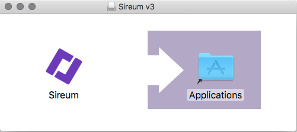

# Sireum: A Software Analysis Platform (v3)

[](https://app.shippable.com/projects/569e46641895ca44747022a7)

[Simplified BSD License](license.md)

## Available Products

* [Sireum Logika: A Program Verifier and a Natural Deduction Proof Checker for Propositional, Predicate, and Programming Logics](http://logika.sireum.org)

## Requirements for Running Sireum

Supported platforms (64-bit only):

* macOS (test platform: [Sierra](http://www.apple.com/macos/sierra/) -- 10.12)

* Linux (test platform: [Manjaro](https://manjaro.github.io) and [Ubuntu](http://www.ubuntu.com) 16.10)

* Windows (test platform: [Windows 10](https://www.microsoft.com/en-us/windows/features))

* [Docker](https://www.docker.com/products/overview) (based on [Ubuntu](http://www.ubuntu.com) 16.10)

## Installing and Running Sireum

Sireum v3 binary distributions that we provide are cryptographically-signed 
just in case you want to ensure that your copy is untampered
[read more](https://www.openbsd.org/papers/bsdcan-signify.html>).

The accompanying [Minisign](https://jedisct1.github.io/minisign/) 
digital signature can be verified using the following command:

```bash
minisign -P RWSJrtRxSDlkZHXVldw0WXJvSfzaEsW9R6vxq0sVKDtbmgzQSb4uOwnu -Vm <file>
```

Alternatively, you can use the following
[signify](https://github.com/search?q=signify+OpenBSD)
command:

```bash
signify -p sireum-v3-key.pub -x <file>.minisig -Vm <file>
```

where ``sireum-v3-key.pub`` can be downloaded from: http://bit.ly/sv3key

### Sireum Integrated Verification Environment (IVE)

Video Tutorial: [Installing Sireum IVE in Windows](http://files.sireum.org/media/sireum-ive-win64.mp4)

Sireum IVE includes a custom [IntelliJ IDEA](http://www.jetbrains.com/idea) Community Edition with various plugins 
installed, along with the Sireum CLI (see below).

In addition to the regular **Release** builds, 
we also provide **Development** builds for trying out Sireum v3 experimental features.

* **macOS**

  Execute the following in a bash terminal:
  
  ```bash
  curl -JLo sireum-v3-ive-mac64.dmg http://bit.ly/sv3ivem && open sireum-v3-ive-mac64.dmg 
  ```
  
  Minisign: http://bit.ly/sv3ivems

  Once it is done, it should open a new window:
  
  
  
  Drag and drop the Sireum icon to the Applications folder.
  
  (Note: the above avoids [GateKeeper](https://support.apple.com/en-us/HT202491); 
  if it is instead downloaded using a browser,
  you need to remove Apple's quarantine extended attribute on the .dmg file before opening it as follows: 
  `xattr -d com.apple.quarantine sireum-v3-idea-mac64.dmg`).
 
  For subsequent instructions, replace `SIREUM_HOME` with `/Applications/Sireum.app/Contents/Resources/sireum-v3`.
  
  To run Sireum IVE, double-click `Sireum` inside `/Applications` (or, in a terminal: `open /Applications/Sireum.app`).
  
  To run Sireum CLI in a terminal: `SIREUM_HOME/sireum`.

  Development Build:

  ```bash
  curl -JLo sireum-v3-dev-ive-mac64.dmg http://bit.ly/sv3divem && open sireum-v3-dev-ive-mac64.dmg 
  ```
  
  Minisign: http://bit.ly/sv3divems

* **Linux**

  Download from: http://bit.ly/sv3ivel

  Minisign: http://bit.ly/sv3ivels
  
  Uncompress it in a folder whose path does not contain a whitespace such as `/opt` 
  (or `~/Applications`, if your home directory path does not contain a whitespace).
  
  For subsequent instructions, replace `SIREUM_HOME` with `/opt/Sireum` (or `~/Applications/Sireum`).
  
  To run Sireum IVE in a terminal: `SIREUM_HOME/idea`.
   
  To run Sireum CLI in a terminal: `SIREUM_HOME/sireum`.

  Development Build: http://bit.ly/sv3divel, Minisign: http://bit.ly/sv3divels

* **Windows**

  Download from: http://bit.ly/sv3ivew
  
  Minisign: http://bit.ly/sv3ivews
  
  Uncompress it to the `C:` drive root directory (i.e., `C:\`) so the file `C:\Sireum\sireum.bat` is present.
  
  For subsequent instructions, replace `SIREUM_HOME` with `C:\Sireum`.
  
  To run Sireum IVE:
  
  * double-click, either:
  
    * 32-bit: `SIREUM_HOME\apps\idea\bin\idea.exe`, or
    
    * 64-bit: `SIREUM_HOME\apps\idea\bin\idea64.exe`
     
      This requires Java 8 64-bit, which is available in `SIREUM_HOME\platform\java`;
      to use that, add `SIREUM_HOME\platform\java\bin` to your `PATH` environment variable.   
  
  * in a terminal: `SIREUM_HOME\idea.bat` or `SIREUM_HOME\idea64.bat`.
  
  To run Sireum CLI in a terminal: `SIREUM_HOME\sireum.bat`

  Development Build: http://bit.ly/sv3divew, Minisign: http://bit.ly/sv3divews

### Sireum Command-Line Interface (CLI)

* **macOS**

  Download from: http://bit.ly/sv3clim
  
  Minisign: http://bit.ly/sv3clims
  
  Uncompress it in a folder whose path does not contain a whitespace such as `/opt` 
  (or `~/Applications`, if your home directory path does not contain a whitespace).
  
  For subsequent instructions, replace `SIREUM_HOME` with `/opt/sireum-v3` (or `~/Applications/sireum-v3`).
  
  To run Sireum CLI in a terminal: `SIREUM_HOME/sireum`.

  Development Build: http://bit.ly/sv3dclim, Minisign: http://bit.ly/sv3dclims

* **Linux**

  Download from: http://bit.ly/sv3clil

  Minisign: http://bit.ly/sv3clils
  
  Uncompress it in a folder whose path does not contain a whitespace such as `/opt` 
  (or `~/Applications`, if your home directory path does not contain a whitespace).
  
  For subsequent instructions, replace `SIREUM_HOME` with `/opt/sireum-v3` (or `~/Applications/sireum-v3`).
  
  To run Sireum CLI in a terminal: `SIREUM_HOME/sireum`.

  Development Build: http://bit.ly/sv3dclil, Minisign: http://bit.ly/sv3dclils

* **Windows**

  Download from: http://bit.ly/sv3cliw

  Minisign: http://bit.ly/sv3cliws
   
  Uncompress it to the `C:` drive root directory (i.e., `C:\`) so the file `C:\sireum-v3\sireum.bat` is present.
  
  For subsequent instructions, replace `SIREUM_HOME` with `C:\sireum-v3`.
  
  To run Sireum CLI in a terminal: `SIREUM_HOME\sireum.bat`.

  Development Build: http://bit.ly/sv3dcliw, Minisign: http://bit.ly/sv3dcliws

## Requirements for Buiding Sireum from Source

### All Supported Platforms

* Required tools for building Sireum: `bash`, `git`, `unzip`, `wget`

### Linux

* Required tools for building Sireum: `xz`

### Windows

* Required tools for building Sireum: [MSYS2](https://msys2.github.io)

  ```bash
  pacman -S git unzip wget
  ```
  
## Installing and Running Sireum from Source

In a bash terminal:

* Using HTTPS:

  ```bash
  git clone https://github.com/sireum/v3.git sireum-v3
  sireum-v3/sireum
  ```

* Using SSH:
 
  ```bash
  git clone git@github.com:sireum/v3.git sireum-v3
  sireum-v3/sireum
  ```
  
(If this is your first time running the script, it first:

* downloads
  [Zulu JDK](https://www.azul.com/products/zulu/),
  [Scala](https://scala-lang.org/),
  [Node.js](https://nodejs.org/)
  and 
  [Sbt](http://www.scala-sbt.org),
  and then installs them under the `platform` directory;

* downloads
  [Z3](https://github.com/Z3Prover/z3/wiki) 
  and installs it under the `apps` directory; and

* [builds](#building-and-testing-sireum-using-sbt)
  and
  [assembles](#assembling-sireum-jar)
  Sireum.)

```
Sireum: A Software Analysis Platform (v3)
(c) 2011-2017, SAnToS Laboratory, Kansas State University
http://sireum.org

Usage: sireum <mode>

Available mode(s):

logika    Logika Program Verifier and Proof Checker
util      Utility Tools
```

## Testing Sireum using Sbt

Run: `sireum-v3/bin/sbt-launch.sh test`

## Building Sireum Distributions

### Building Sireum CLI Distributions

Run: `sireum-v3/distros/build.sh`

The resulting bundles are located at: `sireum-v3/distros`.

### Building Sireum CLI and IVE Distributions

Requirements:

* macOS host

* [dmgbuild](http://dmgbuild.readthedocs.io)

* [P7ZIP](http://p7zip.sourceforge.net)

* [Wine](https://www.winehq.org)

Run: `sireum-v3/distros/build-idea.sh`

The resulting bundles are located at: `sireum-v3/distros`.

## Docker Containers

### Pre-Built Images

Pre-built container images are available at [Docker Hub](https://hub.docker.com):
  
* Sireum CLI: https://hub.docker.com/r/sireum/v3
  
  ```bash
  docker run -it sireum/v3:latest /bin/bash
  ```
  
  Sireum CLI is located at `/opt/sireum-v3/sireum`.
  
* Sireum CLI with [CompCert](http://compcert.inria.fr) (Non-Commercial Only): https://hub.docker.com/r/sireum/v3-compcert/

  ```bash
  docker run -it sireum/v3-compcert:latest /bin/bash
  ```

  Sireum CLI is located at `/opt/sireum-v3/sireum`.

### Building Images

Run: 

* `sireum-v3/docker/build.sh`

  The resulting image name is `sireum/v3:latest`.
  
* With CompCert (Non-Commercial Only): `sireum-v3/docker/build-compcert.sh`

  The resulting image name is `sireum/v3-compcert:latest`.

### Troubleshooting

#### Workaround for Sbt Issue [#2156](https://github.com/sbt/sbt/issues/2156)

If the Sbt builds fails with: ``Could not create directory ...``, then you are
affected by [sbt/sbt#2156](https://github.com/sbt/sbt/issues/2156).

As a workaround, set the ``SIREUM_PARALLEL_BUILD`` environment variable to
``false`` as follows:

```bash
export SIREUM_PARALLEL_BUILD=false
```

#### Ivy2 Cache Corruption
 
In the case that your Ivy2 cache is corrupted;
Sbt will complain about unresolved dependencies, e.g.:

```
...
[warn] 	::::::::::::::::::::::::::::::::::::::::::::::
[warn] 	::          UNRESOLVED DEPENDENCIES         ::
[warn] 	::::::::::::::::::::::::::::::::::::::::::::::
[warn] 	:: junit#junit;4.11: configuration not found in junit#junit;4.11: 'master(compile)'. Missing configuration: 'compile'. It was required from com.novocode#junit-interface;0.11 compile
[warn] 	::::::::::::::::::::::::::::::::::::::::::::::
[warn]
[warn] 	Note: Unresolved dependencies path:
[warn] 		junit:junit:4.11
[warn] 		  +- com.novocode:junit-interface:0.11 (.../sireum-v3/project/SireumBuild.scala#...)
[warn] 		  +- org.sireum:sireum-core-test_2.11:3.0-SNAPSHOT ()
...
sbt.ResolveException: unresolved dependency: junit#junit;4.11: configuration not found in junit#junit;4.11: 'master(compile)'. Missing configuration: 'compile'. It was required from com.novocode#junit-interface;0.11 compile
	at sbt.IvyActions$.sbt$IvyActions$$resolve(IvyActions.scala:291)
	at sbt.IvyActions$$anonfun$updateEither$1.apply(IvyActions.scala:188)
	at sbt.IvyActions$$anonfun$updateEither$1.apply(IvyActions.scala:165)
  ...
```

To fix it, you can delete your Ivy2 cache in, for example, `~/.ivy2/cache` (you can delete only the specific
corrupted library cache such as junit for the example above; in the worst case, delete all cache).

Once you deleted the corrupted cache, run Sbt again and it should work.

#### Other Issues?

Please file a [new GitHub issue](https://github.com/sireum/v3/issues).

## Assembling Sireum Jar

Run: `sireum-v3/bin/sbt-launch.sh assembly`
 
The jar will be located at `sireum-v3/bin/sireum.jar`

## Development Environments

[IntelliJ IDEA](https://www.jetbrains.com/idea/)-based Sireum IVE (or IDEA Ultimate/Community Edition)
are the recommended IDEs for Sireum v3 development.
 
[CLion](https://www.jetbrains.com/clion/) is recommended for C/C++ related development.
JetBrains has graciously provided free licenses JetBrains' toolbox (including CLion) 
for Sireum project members.

### Setting Preferences

* Set IntelliJ's Sbt’s preferences by opening `IntelliJ`->`Preference`->`Build, Execution, Deployment`->`Build Tools`->`SBT`

  * `Max Heap Size`: `4096`

  * `VM Parameters`: `-XX:+UseG1GC -XX:ReservedCodeCacheSize=900m -Xss1M -XX:+CMSClassUnloadingEnabled`

* IntelliJ uses `make` as the default build system.
  For Scala projects, it is best to Sbt using the ([idea-sbt-plugin](https://github.com/orfjackal/idea-sbt-plugin)) plugin.
  
  * Set `idea-sbt-plugin` settings by opening `IntelliJ`->`Preference`->`Other Settings`->`SBT`

    * `VM parameters`: `-Xmx4G -XX:+UseG1GC -XX:ReservedCodeCacheSize=900m -Xss1M -XX:+CMSClassUnloadingEnabled`

    * Check `Use alternative JRE` and point it to `platform/java`

  * In `Run`->`Edit Configurations...`->`Defaults`->{`Application`, `JUnit`, etc.}:

    * Remove `Make` in `Before launch:`

    * Add `SBT` in `Before launch:` then select either `products` (for apps) or `test:products` (for tests) and
      check `Run in current module...`
      
    * Add `SIREUM_HOME` environment variable and set it to the absolute path of the directory containing this file.
